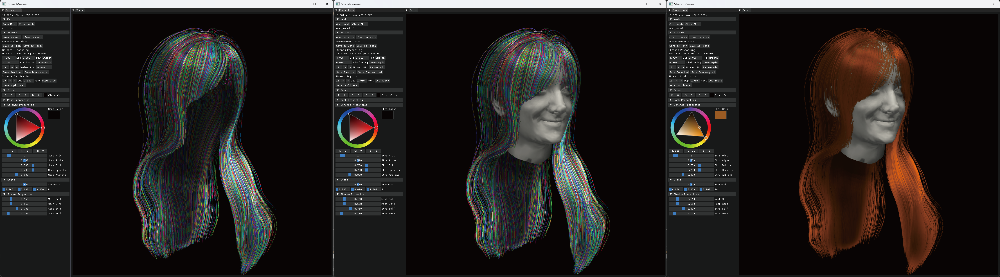

# HairStrandsRendering
This is a simple cross-platform hair rendering tool based on OpenGL and [Dear ImGui](https://github.com/ocornut/imgui). We provide an easy-to-use interface for visualizing strand-based 3D hair models. This project can be useful for hair modeling research.



## Installation
### Third-Party Libraries
- [assimp](https://github.com/assimp/assimp)
- [glfw](https://github.com/glfw/glfw)
- [glad](https://github.com/Dav1dde/glad)
- [Dear ImGui](https://github.com/ocornut/imgui) (branch `Docking` for more functions)
- [glm](https://github.com/g-truc/glm)
- [Eigen](https://eigen.tuxfamily.org/index.php?title=Main_Page)

### Windows
On Windows, we use Visual Studio for development. You can open `HairStrandsRendering.sln` with Visual Studio. For configuration, you need to set the include path and library path of the 3rdparty libraries in the project properties. You can also use [vcpkg](https://github.com/microsoft/vcpkg) to install the 3rdparty libraries instead of compiling from their source code.

We suggest editing the `HairStrandsRendering/HairStrandsRendering.vcxproj` for a quick configuration. For example:
```js
83 <PropertyGroup Condition="'$(Configuration)|$(Platform)'=='Release|x64'">
84   <LinkIncremental>false</LinkIncremental>
85   <IncludePath>$(YOUR_INCLUDE_PATHS)$(IncludePath)</IncludePath>
86 </PropertyGroup>
```

### Linux
Taking ubuntu as an example:
```shell
apt-get install libglfw-dev
apt-get install libassimp-dev
```
Modify the `HairStrandsRendering/Makefile` to set the include path of two header-only libraries [glm](https://github.com/g-truc/glm) and [Eigen](https://eigen.tuxfamily.org/index.php?title=Main_Page).
```shell
17 EIGEN_DIR = $YOUR_EIGEN_DIR
18 GLM_DIR = $YOUR_GLM_DIR
```
Compile the project:
```shell
cd HairStrandsRendering
make -j
# Run the project
./HairStrandsRendering
```
### MacOS
Please install [Homebrew](https://brew.sh/) first.
```shell
brew install libglfw-dev
brew install libassimp-dev
```
Modify the `HairStrandsRendering/Makefile` to set the include path of two header-only libraries [glm](https://github.com/g-truc/glm) and [Eigen](https://eigen.tuxfamily.org/index.php?title=Main_Page).
```shell
17 EIGEN_DIR = $YOUR_EIGEN_DIR
18 GLM_DIR = $YOUR_GLM_DIR
```
Compile the project:
```shell
cd HairStrandsRendering
make -j
# Run the project
./HairStrandsRendering
```

## Usage
I think our interface is already easy-to-use now. The only thing I need to mention is that, in the scene widget, I use the right mouse button to control the view.

## Development
Please feel free to open an issue or pull request if you have any questions or suggestions.

## License
MIT License
## Acknowledgments
We are using [USC-HairSalon](http://www-scf.usc.edu/~liwenhu/SHM/database.html) as our demo data. Thanks to the authors for providing the data. Part of the hair shaders and rendering parameters are based on [Menglei Chai](https://mlchai.com/)'s earlier works. Thanks for his excellent work.